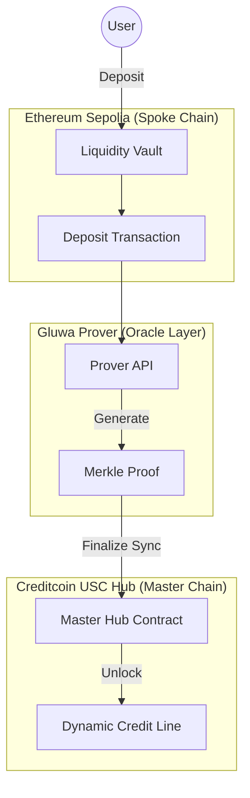

# PayEase [Polaris Protocol // Cross-Chain Credit]

## 🛰️ Project Overview

**PayEase** is a next-generation decentralized credit system powered by the **Polaris Protocol**. It enables users to bridge liquidity from EVM networks (like Ethereum Sepolia) to the **Creditcoin USC Hub**, unlocking global credit limits backed by cross-chain collateral.

By leveraging **Zero-Knowledge Merkle Proofs**, PayEase ensures that assets deposited on any spoke chain are instantly and securely recognized on the Master Hub, providing a seamless "Buy Now, Pay Later" experience across the multi-chain ecosystem.

---

## ⚡ Key Features

- **Cross-Chain Equity Sync**: Deposit USDC/USDT on Sepolia and sync it to the Creditcoin USC Hub via native attestations.
- **Dynamic Credit Scoring**: Automated credit limit calculations based on your total cross-chain equity.
- **ZK-Proof Verification**: Secure validation of liquidity transfers using the Gluwa Prover API.
- **Real-Time Bridge Monitor**: Professional-grade terminal interface to track the status of attestations and Merkle Proof generation.
- **Integrated Checkout**: Instant payment execution against your combined credit line.
- **Lender Yield Generation**: Lenders earn passive APY through a shared-based accounting system, automatically distributed from BNPL loan interest.
- **Protocol Fee Engine**: Automated collection of protocol fees into a secure management vault for ecosystem sustainability.

---

## 🏗️ Technical Architecture

### The Dual-Chain Mirroring System

PayEase operates on a **Master-Spoke** architecture to maximize security and liquidity.



### Stack & Components

- **Frontend**: Next.js 15+, Tailwind CSS, Shadcn/UI (Premium Dark Aesthetic)
- **Authentication**: Privy (Multi-wallet support)
- **Blockchain**:
    - **Master**: Creditcoin USC Testnet 2 (Substrate)
    - **Spoke**: Ethereum Sepolia (EVM)
- **Verification**: Gluwa Prover (Native Merkle Proofs)
- **Backend/Cache**: Supabase + SWR for high-performance UI updates

---

## 📊 Live Implementation Proof

We have successfully implemented and verified the end-to-end cross-chain lifecycle:

1. **Deposit Detection**: Verified on Sepolia.
2. **Attestation Window**: Wait for Creditcoin validator consensus (~2-3 mins).
3. **Proof Generation**: Merkle Proof successfully generated by the Gluwa Prover.
4. **Master Sync**: Successful injection of proof into the USC Hub.

**✅ Verified Sync Transaction:**
[View on USC Hub Explorer](https://explorer.usc-testnet2.creditcoin.network/tx/0xa26760db7d3591c3bf58e5984f85fcde1d993369952a8da985a24f73db40246d)

---

## 🛠️ Installation & Setup

### 1. Clone & Install
```bash
git clone <your-repo-url>
cd PayEase
npm install
```

### 2. Environment Configuration
Create a `.env.local` file with the following:
```env
NEXT_PUBLIC_SUPABASE_URL=your_supabase_url
NEXT_PUBLIC_SUPABASE_KEY=your_supabase_key
NEXT_PUBLIC_PRIVY_APP_ID=your_privy_id
```

### 3. Initialize Database
Run the migrations located in `./database/migrations/` in your Supabase SQL editor to set up:
- Activity Logging
- Pool Caching
- Cross-Chain Transaction Statuses

### 4. Run Development
```bash
npm run dev
```

---

## 🔐 Security & Verification

- **Finality Tracking**: PayEase waits for 12+ confirmations on Sepolia before allowing a Hub Sync.
- **Merkle Proofs**: Every credit increase is backed by a verifiable transaction inclusion proof on-chain.
- **Decentralized Attestation**: Bridge security is handled by the native Creditcoin validator set.
- **Share-Based Yield Distribution**: Sophisticated accounting mechanism ensures fair and accurate distribution of interest to liquidity providers.
- **Encapsulated Protocol Funds**: Fees are managed by a dedicated `ProtocolFunds` contract with strictly controlled administrative access.

---

**Built with 🔥 for the Creditcoin Ecosystem** | **Powered by Polaris Protocol** | **Verified by Gluwa Prover**